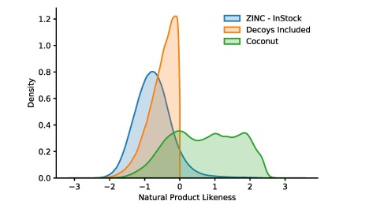
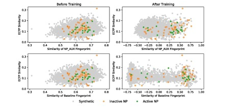

<link rel="stylesheet" type="text/css" media="all" href="stylesheet.css" />

<h1 class="title">Model Card - Natural Product Fingerprint</h1>

::: columns

:::: column
##  Model Details
- Developed by University of Münster, Germany, 2021.
- Multilayer Perceptron and Autoencoder.
- Trained to extract Natural Product Score and Natural Product Fingerprint.

##  Intended Use
- Intended to encode implicit natural product information while keeping enough information on the chemical space of those natural products.
- Not intended to do fingerprint-based virtual screening (FBVS).

##  Factors
- Fingerprints are built using fragments frequently found in natural products.

##  Metrics
- Area under the curve (AUC), measures area under receiver operating characteristics (ROC) curve, it ranges from 0 to 1 while 1 is the perfect classification.
- Enrichment Factor, measures how good active molecules are identified based on similarity.

##   Recommendation
- Improvement could be achieved by per-training the neural networks on completely unrelated data, the focus here is on correctly predicting descriptors and only the final stage models are trained to identify natural products.

::::

:::: column
##  Training Data
- A dataset consisting of natural products and synthetic molecules was made, the Coconut database [2] was updated and used, synthetic molecules were in Zinc [3] "in-stock" library.
- Synthetic compounds had to have similarity of over 0.5 to assure the performance of the neural network.

## Validation Data
- Datasets were collected by Seo et al. [4].
- First dataset to differentiate between synthetic and natural products.
- Second dataset to differentiate between active and inactive natural products
- Third dataset is used to combine the use of the other two, to differentiate between both synthetic and natural and active and inactive.

##  Quantative Analysis

::::

:::

## References
[1] Menke, J., Massa, J., &amp; Koch, O. (2021). Natural product scores and fingerprints extracted from artificial neural networks. Computational and Structural Biotechnology Journal. https://doi.org/10.26434/chemrxiv.14347073 

[2] M. Sorokina, P. Merseburger, K. Rajan, M.A. Yirik, C. Steinbeck
***COCONUT online: Collection of Open Natural Products database***
J Cheminformatics, 13 (2021), pp. 1-13

[3]     T. Sterling, J.J. Irwin
    ***ZINC 15–ligand discovery for everyone***
    J Chem Inform Modeling, 55 (2015), pp. 2324-2337

[4]    M. Seo, H.K. Shin, Y. Myung, S. Hwang, K.T. No
    ***Development of Natural Compound Molecular Fingerprint (NC-MFP) with the Dictionary of Natural Products (DNP) for natural product-based drug development***
    J Cheminformatics, 12 (2020), p. 6